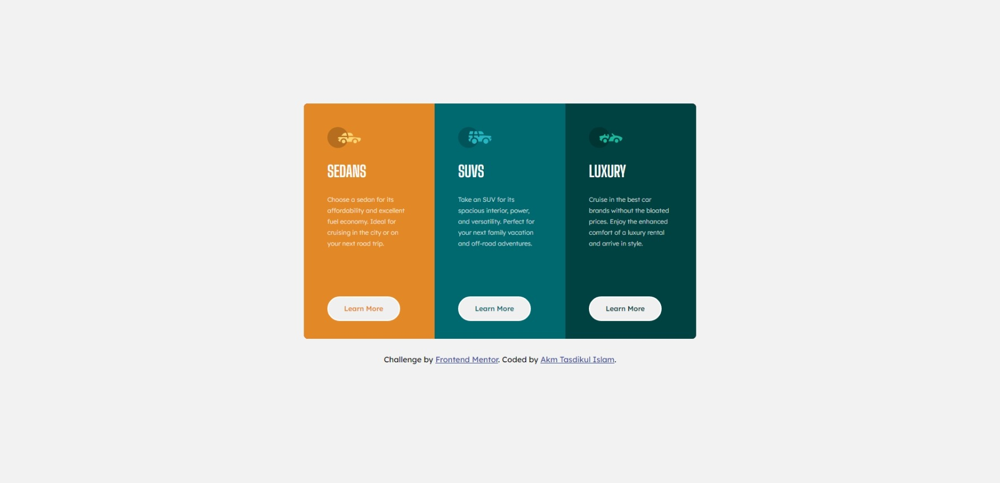
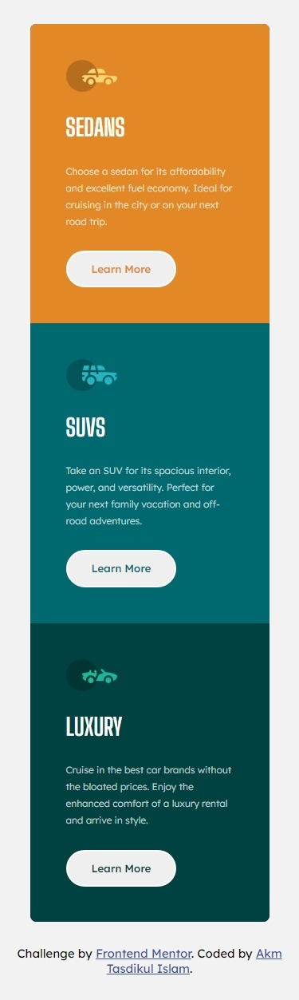

# Frontend Mentor - 3-column preview card component solution

This is a solution to the [3-column preview card component challenge on Frontend Mentor](https://www.frontendmentor.io/challenges/3column-preview-card-component-pH92eAR2-). Frontend Mentor challenges help you improve your coding skills by building realistic projects.

## Table of contents

- [Overview](#overview)
  - [The challenge](#the-challenge)
  - [Screenshot](#screenshot)
  - [Links](#links)
- [My process](#my-process)
  - [Built with](#built-with)
  - [What I learned](#what-i-learned)
- [Author](#author)

## Overview

Project Start Date: 09 February 2024
Project Duration: 02.5 Hours

### The challenge

Users should be able to:

- View the optimal layout depending on their device's screen size
- See hover states for interactive elements

### Screenshot




### Links

- [Solution URL:](https://github.com/akmtasdikulislam/3-column-preview-card-component)
- [Live Site URL:](https://akmtasdikulislam.github.io/3-column-preview-card-component/)

## My process

- At first I've connected the `style.css` file and _Google Fonts CDN_ with `index.html`
- Then imported the **css color variables** according to the _style-guide.md_
- Then initialized the css file and added default height, width, font-family, font-size, font-weight, font-color and background-color to the `body` tag.
- Then wrote necessary `html` code to build _desktop-version_ UI.

  - Here, at first I built a **card** container within `<body>` tag.

  ```html
  <div class="card"></div>
  ```

  - Then, added 3 columns in it. Each of them having a numbered column _id_ and a common _column_ class.

  ```html
  <div class="card">
    <div id="column-1" class="column"></div>
    <div id="column-2" class="column"></div>
    <div id="column-3" class="column"></div>
  </div>
  ```

  - Then, I used _CSS Grid_ to divide the into 3 equal column which are having equal width and same height.

  ```css
  .card {
    display: grid;
    grid-auto-rows: 100%;
    grid-template-columns: repeat(3, 1fr);
    height: 30em;
    width: 50em;
  }
  ```

  - After doing these, I've wrote common _CSS styles_ to the _column_ class.

  ```css
  .column {
    display: flex;
    flex-direction: column;
    gap: 1.75em;
    height: 100%;
    padding: 3em;
    width: 100%;
  }
  ```

  - Then I added _logo_, _title_, _body-text_ & a _Learn More_ button to each column.

  ```html
  <div id="column-1" class="column">
    
    <p class="title">Sedans</p>
    <p class="body-text">
      Choose a sedan for its affordability and excellent fuel economy. Ideal for
      cruising in the city or on your next road trip.
    </p>
    <button>Learn More</button>
  </div>
  ```

  - When it's time to add css style,

    - At first, I've targeted the _.logo_ to take its minimum width in the _column container_

    ```css
    .column .logo {
      width: min-content;
    }
    ```

    - After then, I targeted the _.title_ and assigned it with "Big Shoulders Display" font and required font-size, font-weight, color and transformed all letters to UPPERCASE to match the given UI Design Sample.

    ```css
    .column .title {
      color: white;
      font-family: "Big Shoulders Display", sans-serif;
      font-size: 2em;
      font-weight: 700;
      text-transform: uppercase;
    }
    ```

    - Then also, did the same style work for the _.body-text_ class. Here additionally added `line-height` property to increase distance between lines.

    ```css
    .column .body-text {
      color: var(--transparent-white);
      font-size: 0.8em;
      font-weight: 300;
      line-height: 1.75em;
    }
    ```

    - And then finally, designed the _Learn More_ button. To design this, its height & width is set to `max-content` so that it can display single line button text on any viewport.

- And also wrote necessary `css` code to match as close as possible to the given _UI Design Sample_.
- After completing the _desktop-version: UI Development_, I wrote ncessary css _media-queries_ to match the _mobile-version UI design_ of the project.

### Built with

- Semantic HTML5 markup
- CSS custom properties
- Flexbox
- CSS Grid

### What I learned

Use this section to recap over some of your major learnings while working through this project. Writing these out and providing code samples of areas you want to highlight is a great way to reinforce your own knowledge.

To see how you can add code snippets, see below:

```html
<h1>Some HTML code I'm proud of</h1>
```

```css
.proud-of-this-css {
  color: papayawhip;
}
```

```js
const proudOfThisFunc = () => {
  console.log("🎉");
};
```

If you want more help with writing markdown, we'd recommend checking out [The Markdown Guide](https://www.markdownguide.org/) to learn more.

## Author

- Frontend Mentor - [@akmtasdikulislam](https://www.frontendmentor.io/profile/akmtasdikulislam)
- Twitter - [@Akm_Tasdikul](https://www.twitter.com/@Akm_Tasdikul)
