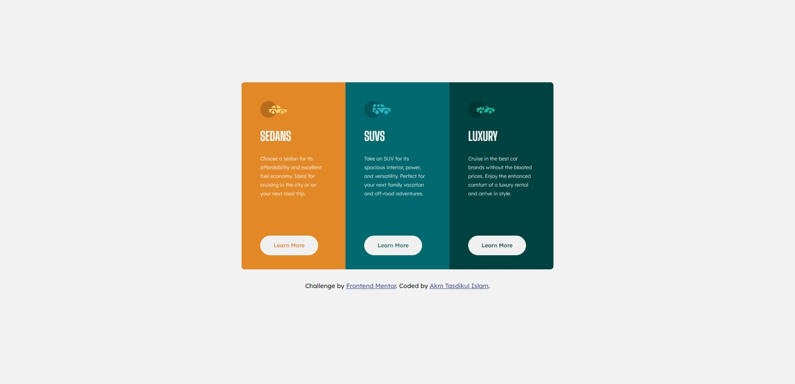
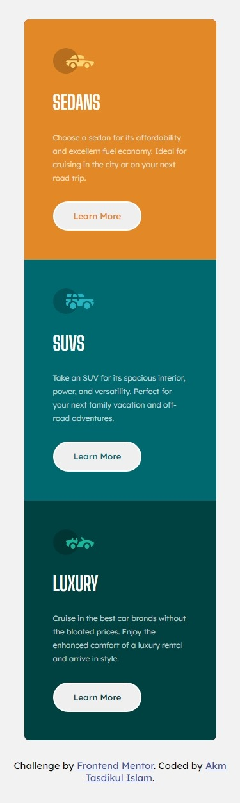

# Frontend Mentor - 3-column preview card component solution

This is a solution to the [3-column preview card component challenge on Frontend Mentor](https://www.frontendmentor.io/challenges/3column-preview-card-component-pH92eAR2-). Frontend Mentor challenges help you improve your coding skills by building realistic projects.

## Table of contents

- [Overview](#overview)
  - [The challenge](#the-challenge)
  - [Screenshot](#screenshot)
  - [Links](#links)
- [My process](#my-process)
  - [Built with](#built-with)
  - [What I learned](#what-i-learned)
- [Author](#author)

## Overview

Project Start Date: 09 February 2024
Project Duration: 02.5 Hours

### The challenge

Users should be able to:

- View the optimal layout depending on their device's screen size
- See hover states for interactive elements

### Screenshot




### Links

- [Solution URL:](https://github.com/akmtasdikulislam/3-column-preview-card-component)
- [Live Site URL:](https://akmtasdikulislam.github.io/3-column-preview-card-component/)

## My process

- At first I've connected the `style.css` file and _Google Fonts CDN_ with `index.html`
- Then imported the **css color variables** according to the _style-guide.md_
- Then initialized the css file and added default height, width, font-family, font-size, font-weight, font-color and background-color to the `body` tag.
- Then wrote necessary `html` code to build _desktop-version_ UI.

  - Here, at first I built a **card** container within `<body>` tag.

  ```html
  <div class="card"></div>
  ```

  - Then, added 3 columns in it. Each of them having a numbered column _id_ and a common _column_ class.

  ```html
  <div class="card">
    <div id="column-1" class="column"></div>
    <div id="column-2" class="column"></div>
    <div id="column-3" class="column"></div>
  </div>
  ```

  - Then, I used _CSS Grid_ to divide the into 3 equal column which are having equal width and same height.

  ```css
  .card {
    display: grid;
    grid-auto-rows: 100%;
    grid-template-columns: repeat(3, 1fr);
    height: 30em;
    width: 50em;
  }
  ```

  - After doing these, I've wrote common _CSS styles_ to the _column_ class.

  ```css
  .column {
    display: flex;
    flex-direction: column;
    gap: 1.75em;
    height: 100%;
    padding: 3em;
    width: 100%;
  }
  ```

  - Then I added _logo_, _title_, _body-text_ & a _Learn More_ button to each column.

  ```html
  <div id="column-1" class="column">
    
    <p class="title">Sedans</p>
    <p class="body-text">
      Choose a sedan for its affordability and excellent fuel economy. Ideal for
      cruising in the city or on your next road trip.
    </p>
    <button>Learn More</button>
  </div>
  ```

  - When it's time to add css style,

    - At first, I've targeted the _.logo_ to take its minimum width in the _column container_

    ```css
    .column .logo {
      width: min-content;
    }
    ```

    - After then, I targeted the _.title_ and assigned it with "Big Shoulders Display" font and required font-size, font-weight, color and transformed all letters to UPPERCASE to match the given UI Design Sample.

    ```css
    .column .title {
      color: white;
      font-family: "Big Shoulders Display", sans-serif;
      font-size: 2em;
      font-weight: 700;
      text-transform: uppercase;
    }
    ```

    - Then also, did the same style work for the _.body-text_ class. Here additionally added `line-height` property to increase distance between lines.

    ```css
    .column .body-text {
      color: var(--transparent-white);
      font-size: 0.8em;
      font-weight: 300;
      line-height: 1.75em;
    }
    ```

    - And then finally, designed the _Learn More_ button.

      - To design this, its height & width is set to `max-content` so that it can display single line button text on any viewport.

      ```css
      .column button {
        *height: max-content;
        *width: max-content;
      }
      ```

      - Then I added padding. Here padding on each sides of the _button-text_ is almost double than the padding on the top & below of it to make a wide button.

      ```css
      .column button {
        height: max-content;
        width: max-content;
        *padding: 1em 2.25em;
      }
      ```

      - After, this necessary font-family & font-weight is added.

      ```css
      .column button {
        height: max-content;
        width: max-content;
        padding: 1em 2.25em;
        *font-family: "Lexend Deca", sans-serif;
        *font-weight: 500;
      }
      ```

      - Then, ouline was removed and added a white border within it. Also a little bit of rounded corner is added to it using _border-radius_.

      ```css
      .column button {
        height: max-content;
        width: max-content;
        padding: 1em 2.25em;
        font-family: "Lexend Deca", sans-serif;
        font-weight: 500;
        *outline: 0;
        *border: 2px solid white;
        *border-radius: 10em;
      }
      ```

      - Finally, the button was positioned `relative` with its parent to push it somewhat donward from the top to match the UI Design Sample.

      ```css
      .column button {
        height: max-content;
        width: max-content;
        padding: 1em 2.25em;
        font-family: "Lexend Deca", sans-serif;
        font-weight: 500;
        outline: 0;
        border: 2px solid white;
        border-radius: 10em;
        *position: relative;
        *top: 18%;
      }
      ```

    - At last, added necessary _hover effect_ for the **active-state** of the button. Here, first of all a transparent background was set, then a _pointer_ cursor was set to appear on hover and finally a transition was added to visualize a smooth change of button state.

    ```css
    .column button:hover {
      background-color: transparent;
      cursor: pointer;
      transition: all ease-in-out 0.2s;
    }
    ```

  - Then, I target each column through their respective _id_ and styled it to match the UI Design Sample.

  ```css
  #column-1 {
    background-color: var(--bright-orange);
  }
  #column-1 button {
    color: var(--bright-orange);
  }
  #column-1 button:hover {
    color: white;
  }

  #column-2 {
    background-color: var(--dark-cyan);
  }
  #column-2 button {
    color: var(--dark-cyan);
  }
  #column-2 button:hover {
    color: white;
  }

  #column-3 {
    background-color: var(--very-dark-cyan);
  }
  #column-3 button {
    color: var(--very-dark-cyan);
  }
  #column-3 button:hover {
    color: white;
  }
  ```

- After completing the _desktop-version: UI Development_, I wrote ncessary css _media-queries_ to match the _mobile-version UI design_ of the project. Here, at first redesigned the card container and assigned it css grid property then touched every column and positioned them to follow the given mobile-version:UI Design Sample.

```css
@media (max-width: 375px) {
  .card {
    width: 20em;
    height: 75em;
    grid-auto-columns: 100%;
    grid-auto-flow: row;
    grid-template-rows: repeat(3, 1fr);
    margin-top: 2em;
  }

  .column {
    height: max-content;
  }

  #column-1 {
    grid-row: 1/2;
    grid-column: 1/-1;
  }

  #column-2 {
    grid-row: 2/3;
    grid-column: 1/-1;
  }

  #column-3 {
    grid-row: 3/-1;
    grid-column: 1/-1;
  }
}
```

### Built with

- Semantic HTML5 markup
- CSS custom properties
- Flexbox
- CSS Grid

### What I learned

By doing this project, I've learned to use the following _css GRID properties_"

1. grid-row
2. grid-column
3. grid-template-column
4. grid-auto-rows
5. grid-auto-flow

## Author

- Frontend Mentor - [@akmtasdikulislam](https://www.frontendmentor.io/profile/akmtasdikulislam)
- Twitter - [@Akm_Tasdikul](https://www.twitter.com/@Akm_Tasdikul)
